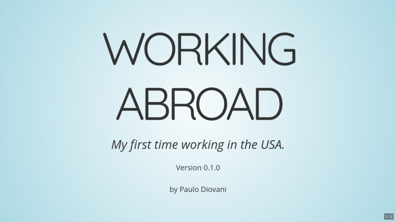

# Working Abroad

Paulo Diovani conta sua experiência indo à trabalho para o exterior pela primeira vez.

Em Phoenix, Arizona, que dificuldades encontramos na cultura local e na forma como os norte americanos trabalham?

Esta talk mostra alguns requisitos para trabalhar no exterior e como é a experiência de quem o faz. Seja você um nômade virtual, um freelancer ou esteja procurando oportunidades fora do país, será presenteado com uma visão de com é trabalhar nos Estados Unidos.

